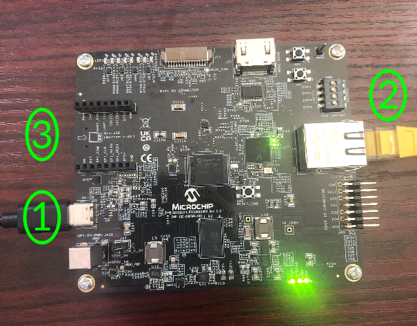
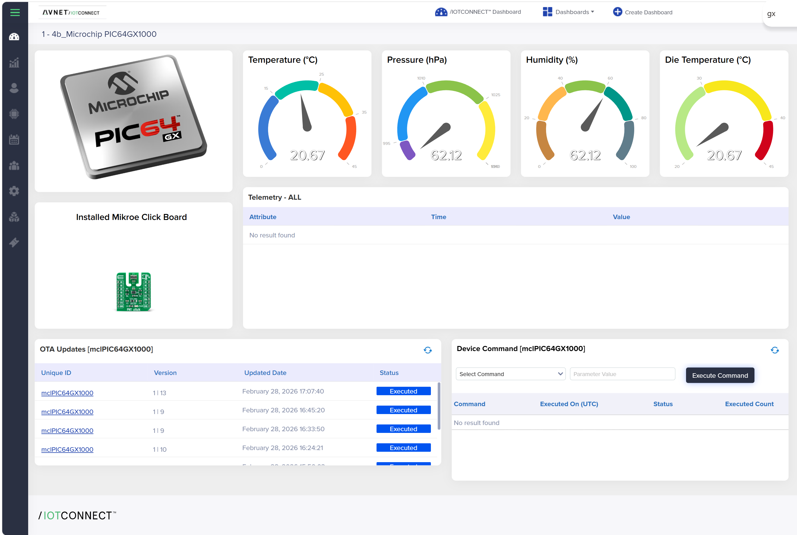

# Quickstart: Curiosity PIC64GX1000 to /IOTCONNECT

Board out of the box to live telemetry on an /IOTCONNECT dashboard. Nothing in this guide is compiled: you flash a prebuilt Ubuntu image, install a published Snap, and run stock Python scripts from this repository.

Allow roughly 45 minutes, most of which is the first `apt` update on the board.

| Step | What happens |
| --- | --- |
| [1](#1-what-you-need) | Gather hardware and host software |
| [2](#2-connect-the-board) | Cable up the kit |
| [3](#3-boot-ubuntu) | Boot Ubuntu 24.04 riscv64 and get on the network |
| [4](#4-install-and-provision-the-iotconnect-snap) | Install the Snap and onboard the device |
| [5](#5-import-the-device-template-and-dashboard) | Import the device template and dashboard |
| [6](#6-get-the-example-applications) | Copy the example applications to the board |
| [7](#7-run-a-demo) | Publish telemetry |
| [8](#8-verify-in-iotconnect) | Confirm data on the dashboard |
| [9](#9-send-a-command-from-the-cloud) | Send a cloud-to-device command |

---

## 1. What you need

**Hardware**

- Microchip Curiosity PIC64GX1000 Kit, including the supplied USB-C cable and microSD card
- Ethernet connection with DHCP
- Host PC (Windows, Linux or macOS)
- Optional, for the sensor demo: [mikroE PHT Click (MS8607)](https://www.mikroe.com/pht-click)

**Host software**

- A serial terminal: [TeraTerm](https://github.com/TeraTermProject/teraterm/releases) or [PuTTY](https://www.putty.org/) on Windows, `screen` or `minicom` on Linux and macOS
- An SD card writer such as [balenaEtcher](https://etcher.balena.io/) or `dd`, only if you need to rewrite the microSD card

**Cloud**

- An /IOTCONNECT account. If you do not have one, start with a [free trial](https://subscription.iotconnect.io/).

---

## 2. Connect the board



1. Connect the supplied USB-C cable from your PC to the USB-C connector labelled **1**. This provides both power and the serial console.
2. Connect Ethernet from your router or switch to the connector labelled **2**.
3. Confirm the microSD card is fully seated in the slot labelled **3**. It should click into place.

If you power the board from the barrel jack (J7) instead, set jumper J47 accordingly and do not power over USB-C at the same time.

---

## 3. Boot Ubuntu

The kit ships with a bootable Ubuntu microSD card. Skip to [3.2](#32-first-login) if you are using it as supplied.

### 3.1 Write the image (only if needed)

Download the current preinstalled server image for this board from [Ubuntu for RISC-V](https://ubuntu.com/download/risc-v), then write it to the microSD card. Nothing is built; the image is used as published.

```bash
xzcat ubuntu-24.04.*-preinstalled-server-riscv64+pic64gx.img.xz \
  | sudo dd of=/dev/sdX bs=4M status=progress conv=fsync
sync
```

Replace `/dev/sdX` with the card device reported by `lsblk`. On Windows, balenaEtcher accepts the `.img.xz` file directly.

Windows and Linux hosts each need one-time serial driver setup before the console appears. Follow section 3.1 (Windows) or 3.2 (Linux) of the [Microchip kit quickstart guide](https://ww1.microchip.com/downloads/aemDocuments/documents/MPU64/ProductDocuments/UserGuides/production-kit-qsguide/Curiosity-PIC64GX1000-Kit_QSGuide.pdf). Linux users should copy the udev rules from [`70-microchip.rules`](https://github.com/avnet-iotconnect/iotc-python-lite-sdk-demos/blob/main/microchip-pic64gx1000/70-microchip.rules) rather than retyping them from the PDF, where one rule is line-wrapped.

### 3.2 First login

Open a serial terminal at **115200 8N1**. The board presents several UARTs; the Linux console is normally the first one.

```bash
# Linux or macOS
sudo screen /dev/ttyACM0 115200
```

On Windows, open the corresponding COM port in TeraTerm or PuTTY.

Power-cycle the board and wait for the login prompt. Log in as `ubuntu` with password `ubuntu`; you are prompted to set a new password on first login.

### 3.3 Network and packages

Confirm the board has an address:

```bash
ip -brief address show
```

The default package sources on this image point at an architecture that does not serve riscv64 packages. Replace them once:

```bash
sudo tee /etc/apt/sources.list > /dev/null <<'EOF'
deb http://ports.ubuntu.com/ubuntu-ports noble main restricted universe multiverse
deb http://ports.ubuntu.com/ubuntu-ports noble-updates main restricted universe multiverse
deb http://ports.ubuntu.com/ubuntu-ports noble-security main restricted universe multiverse
deb http://ports.ubuntu.com/ubuntu-ports noble-backports main restricted universe multiverse
EOF

sudo rm -f /etc/apt/sources.list.d/ubuntu.sources
sudo apt-get clean
sudo apt-get update
```

`apt-get update` can take several minutes on this board. Then install what the examples need:

```bash
sudo apt-get install -y snapd git python3-pip i2c-tools
sudo reboot
```

`snapd` needs the reboot before it will install Snaps.

---

## 4. Install and provision the /IOTCONNECT Snap

```bash
sudo snap install iotconnect
```

Provision the device **as root** so that credentials and sockets land in the system-wide location the example applications expect:

```bash
sudo snap run iotconnect.setup
```

The wizard offers two flows:

- **Manual** - you paste the company ID, environment and device credentials from the /IOTCONNECT portal.
- **Automated** - you supply a REST API key and the wizard registers the device for you.

Either way, record the **device unique ID** you assign; you need it in step 5. Device configuration and certificates are written to `/var/snap/iotconnect/common/`.

Start the socket bridge as a system service:

```bash
sudo snap start iotconnect.socket
sudo snap logs iotconnect.socket -f
```

You are looking for:

```
[IOTCONNECT] SDK Connected.
[SOCKET] Listening on /var/snap/iotconnect/common/iotc.sock
[COMMAND-SOCKET] Listening on /var/snap/iotconnect/common/iotc_cmd.sock
```

Press `Ctrl+C` to stop following the log; the service keeps running.

> Run the bridge with `sudo snap start iotconnect.socket` (service) or `sudo snap run iotconnect.socket-debug` (foreground). Both place the sockets under `/var/snap/iotconnect/common/`, which is the path hard-coded in the PHT and CPU applications. Running `snap run iotconnect.socket-debug` without `sudo` puts them under `~/snap/iotconnect/common/` instead.

---

## 5. Import the device template and dashboard

Both files are in [files/](./files/) in this repository. Download them to the machine running your browser:

- [`pic64gx1000-device-template.json`](./files/pic64gx1000-device-template.json)
- [`pic64gx1000-dashboard-template.json`](./files/pic64gx1000-dashboard-template.json)

**Device template** (import this first, because the dashboard binds to its attributes):

1. In /IOTCONNECT, go to **Device** > **Templates**.
2. Select **Create Template** > **Import**, choose `pic64gx1000-device-template.json`, and save.
3. Assign the template to your device under **Device** > **Devices** > *your device* if you did not already select it during onboarding.

The template carries 32 attributes covering all three example applications and 11 commands. Attribute names must match the JSON keys the applications publish, so do not rename them.

**Dashboard:**

1. Go to **Dashboard** and select **Create Dashboard** > **Import**.
2. Choose `pic64gx1000-dashboard-template.json` and save.
3. The export was captured against a device with unique ID `mclPIC64GX1000`. Edit each widget and re-select your own device and attributes, then save. Layout, gauge ranges, colour bands and titles are preserved.

You should now have this dashboard, waiting for data:



---

## 6. Get the example applications

On the board:

```bash
cd ~
git clone https://github.com/avnet-iotconnect/iotc-python-lite-snap-examples.git
cd iotc-python-lite-snap-examples/examples/microchip-curiosity-pic64gx1000/applications
ls -l
```

If the board has no access to GitHub, copy the three files from `applications/` over `scp` instead. They are plain Python scripts with no build step.

The CPU application uses `psutil` when it is present and falls back to `/proc` and `/sys` when it is not. The PHT application needs `smbus2`:

```bash
pip3 install --break-system-packages psutil smbus2
```

---

## 7. Run a demo

### Option A - CPU performance, no extra hardware

This is the fastest end-to-end proof and needs nothing beyond the board.

```bash
python3 perf_iotc_socket.py --freq 5
```

Expected output every five seconds:

```
[TX] {'timestamp': 1761000000, 'CPU_usage': 7.2, 'CPU_load1': 0.11, 'CPU_load5': 0.09,
      'CPU_load15': 0.08, 'CPU_cores': 4, 'CPU_freq_mhz': 600.0, 'freq': 5.0, 'source': 'cpu_perf'}
```

### Option B - PHT Click sensor, drives the reference dashboard

1. Power the board down, seat the PHT Click in the mikroBUS socket with the notch matching the silkscreen, and power up again.
2. Confirm the I&sup2;C bus is present and the sensor answers:

```bash
ls -l /dev/i2c-*
sudo i2cdetect -y 0
```

You should see addresses `0x40` (humidity) and `0x76` (pressure and temperature).

> No `/dev/i2c-*` nodes? The mikroBUS I&sup2;C controllers are disabled in some device trees. Enabling them is a one-time step documented in [DEVELOPER_GUIDE.md, section 7](./DEVELOPER_GUIDE.md#7-enabling-i2c-for-mikrobus). Until then, use Option A.

3. Run the application:

```bash
python3 pht_iotc_socket.py
```

Expected output every ten seconds:

```
TX: {'timestamp': 1761000000, 'PHT_temp': 22.4, 'PHT_pressure': 995.2,
     'PHT_humidity': 41.6, 'PHT_die_temp': 22.9}
```

Stop either application with `Ctrl+C`.

---

## 8. Verify in /IOTCONNECT

1. Open **Device** > **Devices** > *your device* > **Live Data** and confirm messages are arriving with the expected attribute names.
2. Open your imported dashboard. With the PHT application running, the four gauges track the sensor and the **Telemetry - ALL** table fills in with timestamps.

If Live Data shows messages but the dashboard is empty, the widgets are still bound to the exported device. Re-open each widget and select your device, as described in step 5.

---

## 9. Send a command from the cloud

The CPU application accepts a `freq` command that changes its publish interval.

1. Start `perf_iotc_socket.py` and leave it running.
2. On the dashboard, use the **Device Command** widget: select **Set Publish Interval**, enter `2` as the parameter value, and select **Execute Command**.
3. The board logs `[CMD] freq -> 2.0s (applied)` and telemetry immediately speeds up. The acknowledgement appears back in the widget's command history.

Commands can also be issued from **Device** > **Devices** > *your device* > **Commands**.

---

## Troubleshooting

| Symptom | Cause and fix |
| --- | --- |
| No serial output | Try another USB-C cable or port, then `dmesg \| grep -E 'ttyACM\|ttyUSB'`. Windows and Linux both need the driver or udev setup from the Microchip quickstart guide. |
| `apt-get update` fails on every repository | The sources replacement in [step 3.3](#33-network-and-packages) was skipped, or DNS is unavailable. |
| `snap install` reports that snapd is unavailable | Install `snapd` and reboot before installing the Snap. |
| `[IOTCONNECT] SDK Connected.` never appears | Re-run `sudo snap run iotconnect.setup`, then check outbound MQTT over TCP 8883 is permitted on your network. |
| `FileNotFoundError: /var/snap/iotconnect/common/iotc.sock` | The bridge is not running, or it was started unprivileged. Use `sudo snap start iotconnect.socket` and confirm with `snap services iotconnect`. |
| No `/dev/i2c-*` | Enable the mikroBUS I&sup2;C controllers, see [DEVELOPER_GUIDE.md section 7](./DEVELOPER_GUIDE.md#7-enabling-i2c-for-mikrobus). |
| `i2cdetect` shows no `0x40` or `0x76` | Reseat the Click board and confirm mikroBUS is supplying 3.3 V. |
| Telemetry appears in Live Data but attributes show as unknown | The device template attribute names do not match the published JSON keys. Re-import `pic64gx1000-device-template.json`. |

---

## Next steps

- Keep the applications running across reboots with systemd: [DEVELOPER_GUIDE.md, section 8](./DEVELOPER_GUIDE.md#8-running-as-a-service).
- Deliver new scripts or models to the board over the air: [DEVELOPER_GUIDE.md, section 9](./DEVELOPER_GUIDE.md#9-ota-updates).
- Run the camera demo with live overlay streaming: [OPERATOR_GUIDE.md](./OPERATOR_GUIDE.md).
- Publish your own telemetry from any language that can write to a UNIX socket: [DEVELOPER_GUIDE.md, section 3](./DEVELOPER_GUIDE.md#3-socket-contract).
