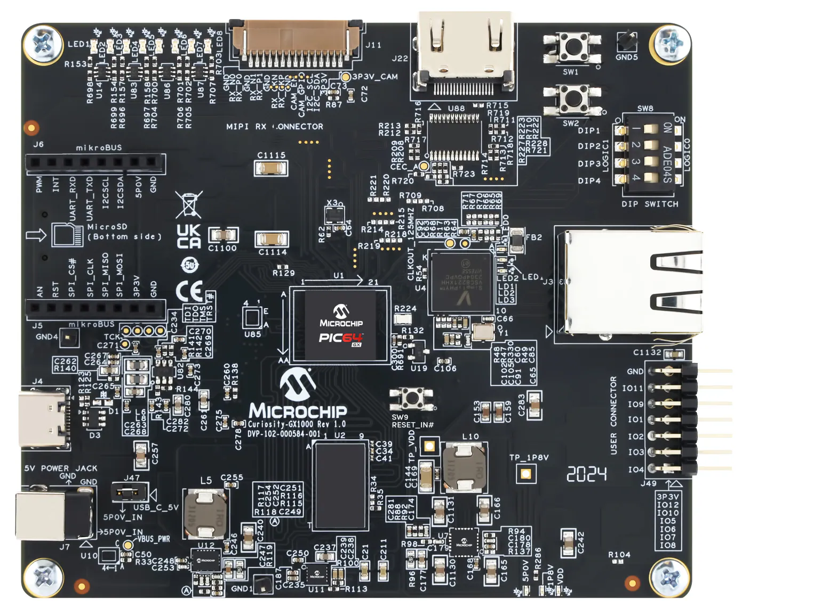

# Microchip Curiosity PIC64GX1000 Kit + /IOTCONNECT Snap

Reference example for connecting the **Microchip Curiosity PIC64GX1000 Kit** running **Ubuntu 24.04 (riscv64)** to **/IOTCONNECT** using the official [`iotconnect` Snap](https://snapcraft.io/iotconnect).

The Snap provides provisioning, MQTT connectivity, cloud-to-device commands and OTA. Your application publishes JSON to a local UNIX socket and reads commands from a second socket, so no /IOTCONNECT SDK code, credentials handling, or cross-compilation is required in your application.

<table>
  <tr>
    <td width="42%"></td>
    <td>The Curiosity PIC64GX1000 Kit is built around a quad-core, 64-bit RISC-V application-class processor that runs Linux alongside real-time workloads. The board provides 1 GB DDR4, a microSD slot for booting Linux, Gigabit Ethernet, three UARTs and a JTAG debug channel over USB-C, a MIPI CSI-2 receiver, HDMI output, and a mikroBUS socket for Click boards using I&sup2;C and SPI.</td>
  </tr>
</table>

---

## Start here

| If you want to | Read |
| --- | --- |
| Get telemetry on a dashboard as fast as possible, without building anything | **[QUICKSTART.md](./QUICKSTART.md)** |
| Understand the architecture, socket protocol, templates, services and OTA | **[DEVELOPER_GUIDE.md](./DEVELOPER_GUIDE.md)** |
| Run and tune the camera / inference demo during a live demonstration | **[OPERATOR_GUIDE.md](./OPERATOR_GUIDE.md)** |

The quickstart requires no compilation: you flash a prebuilt Ubuntu image, install a published Snap, and run stock Python scripts.

---

## Dashboard

The included dashboard export reproduces the layout below, which is the reference demo view for this kit.


| Widget | Bound to | Purpose |
| --- | --- | --- |
| Product image | Static URL | Board identification for the demo |
| Temperature gauge | `PHT_temp` | MS8607 barometric temperature, 0-45 C with comfort bands |
| Pressure gauge | `PHT_pressure` | MS8607 pressure, 990-1040 hPa |
| Humidity gauge | `PHT_humidity` | MS8607 relative humidity, 0-100 % |
| Die temperature gauge | `PHT_die_temp` | MS8607 humidity-die temperature, 20-45 C |
| Telemetry - ALL | All PHT attributes plus `freq`, `osr` | Live attribute/value table with timestamps |
| Installed Mikroe Click Board | Static URL | Shows which Click board the demo expects |
| OTA Updates | Device | OTA history and status per device |
| Device Command | Device template | Sends commands such as `freq` back to the board |

Import files are in [files/](./files/):

- [`pic64gx1000-device-template.json`](./files/pic64gx1000-device-template.json) - device template with the attributes and commands used by all three applications. Import this **first**.
- [`pic64gx1000-dashboard-template.json`](./files/pic64gx1000-dashboard-template.json) - the dashboard export shown above.

Import steps are in [QUICKSTART.md, step 5](./QUICKSTART.md#5-import-the-device-template-and-dashboard).

---

## Applications

All applications live in [applications/](./applications/) and speak the same socket contract.

| Application | Extra hardware | Publishes | Accepts commands |
| --- | --- | --- | --- |
| [`pht_iotc_socket.py`](./applications/pht_iotc_socket.py) | mikroBUS PHT Click (MS8607) | `PHT_temp`, `PHT_pressure`, `PHT_humidity`, `PHT_die_temp` | No |
| [`perf_iotc_socket.py`](./applications/perf_iotc_socket.py) | None | `CPU_usage`, `CPU_load1/5/15`, `CPU_cores`, `CPU_freq_mhz`, `CPU_temp_c` | `freq` |
| [`vision_iotc_socket.py`](./applications/vision_iotc_socket.py) | USB or CSI camera, or a video file | `object1-3`, `confidence1-3`, `detections`, `infer_ms`, `model` | `start`, `stop`, `set_conf`, `set_fps`, `set_interval`, `set_source`, `set_model`, `status` |

`perf_iotc_socket.py` is the zero-hardware path: it runs on a bare board and is the fastest way to prove the connection end to end. `pht_iotc_socket.py` drives the dashboard above.

Telemetry schemas and the full command reference are in the [developer guide](./DEVELOPER_GUIDE.md#5-application-reference).

---

## How it fits together

```
   Curiosity PIC64GX1000 (Ubuntu 24.04 riscv64)
   ┌──────────────────────────────────────────────────────────┐
   │                                                          │
   │  Example application            iotconnect Snap          │
   │  ┌───────────────────┐          ┌────────────────────┐   │
   │  │ pht / perf /      │  JSON    │ iotc.sock      (TX) │  │        ┌──────────────┐
   │  │ vision            │─────────▶│                    │──┼── MQTT ▶│ /IOTCONNECT  │
   │  │                   │◀─────────│ iotc_cmd.sock  (RX) │  │◀───────│              │
   │  └───────────────────┘ commands └────────────────────┘   │        └──────────────┘
   │        ▲                                                 │
   │        │ I2C / V4L2                                      │
   │  ┌─────┴───────────┐                                     │
   │  │ PHT Click, USB  │                                     │
   │  │ or CSI camera   │                                     │
   │  └─────────────────┘                                     │
   └──────────────────────────────────────────────────────────┘
```

Sockets, when the Snap service runs as root:

| Direction | Path |
| --- | --- |
| Telemetry out (device to cloud) | `/var/snap/iotconnect/common/iotc.sock` |
| Commands in (cloud to device) | `/var/snap/iotconnect/common/iotc_cmd.sock` |

Running the bridge unprivileged relocates both sockets under `~/snap/iotconnect/common/`. See [socket path resolution](./DEVELOPER_GUIDE.md#3-socket-contract).

---

## Folder contents

```
microchip-curiosity-pic64gx1000/
├── README.md                 This page
├── QUICKSTART.md             Board to dashboard, no compilation
├── DEVELOPER_GUIDE.md        Architecture, protocol, services, OTA
├── OPERATOR_GUIDE.md         Live-demo runbook for the vision application
├── applications/
│   ├── pht_iotc_socket.py    MS8607 PHT Click telemetry
│   ├── perf_iotc_socket.py   CPU performance telemetry with freq command
│   └── vision_iotc_socket.py Camera inference telemetry with runtime control
├── files/
│   ├── pic64gx1000-device-template.json     Import first
│   └── pic64gx1000-dashboard-template.json  Import second
└── media/
    ├── board-connections.png
    ├── dashboard.png
    └── pic64gx-product.png
```

---

## Resources

- [Purchase the Curiosity PIC64GX1000 Kit](https://www.newark.com/microchip/curiosity-pic64gx1000-kit/curiosity-kit-64bit-risc-v-quad/dp/46AM3917)
- [Kit user guide (PDF)](https://ww1.microchip.com/downloads/aemDocuments/documents/MPU64/ProductDocuments/SupportingCollateral/PIC64GX_Curiosity_Kit_User_Guide.pdf)
- [Kit quickstart guide (PDF)](https://ww1.microchip.com/downloads/aemDocuments/documents/MPU64/ProductDocuments/UserGuides/production-kit-qsguide/Curiosity-PIC64GX1000-Kit_QSGuide.pdf)
- [All Microchip resources for this kit](https://www.microchip.com/en-us/development-tool/curiosity-pic64gx1000-kit)
- [mikroE PHT Click (MS8607)](https://www.mikroe.com/pht-click)
- [`iotconnect` Snap on Snapcraft](https://snapcraft.io/iotconnect)
- [/IOTCONNECT Snap user and developer guide](../../IOTCONNECT_SNAP_User_Developer_Guide.md)
- [/IOTCONNECT Microchip partner guides](https://avnet-iotconnect.github.io/partners/microchip/)
- [/IOTCONNECT knowledge base](https://help.iotconnect.io/)
